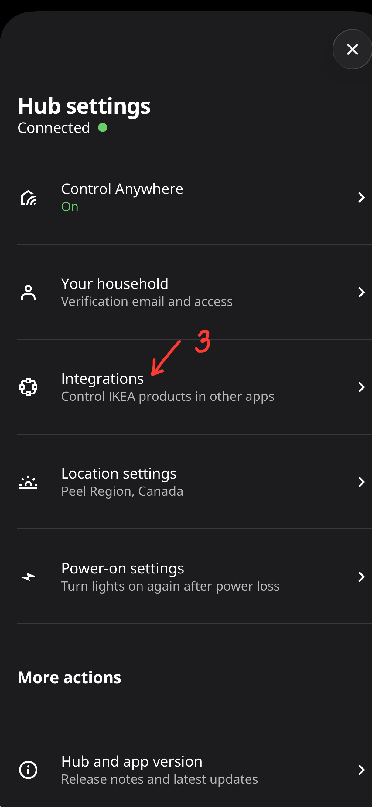
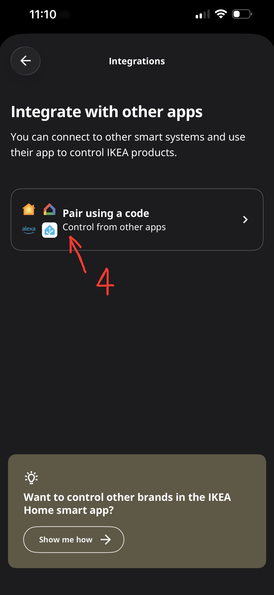
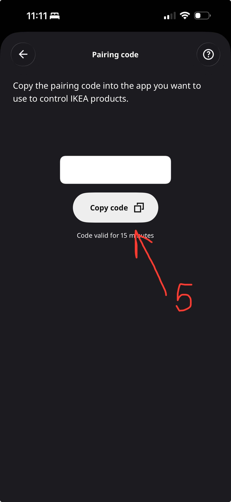
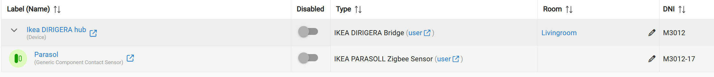

# IKEA DIRIGERA Hub Integration for Hubitat

**Project:** Custom Matter Bridge Driver for IKEA DIRIGERA
**Author:** Aniva
**Version:** 1.1.0

## Overview
This driver acts as a custom "Matter Bridge" for the IKEA DIRIGERA Hub. By default, Hubitat's generic Matter driver filters out data from unknown devices and provides limited telemetry.

**This driver allows you to:**
* Bypass standard Hubitat filters to discover "Unsupported" IKEA devices.
* Correctly decode IKEA's specific Matter attributes (fixing 0-200 battery scales, etc.).
* Route raw events to custom child drivers for full functionality.

---

## Supported Devices
The following devices have dedicated "Component Drivers" optimized for this bridge:

* **[IKEA PARASOLL Zigbee Sensor](../IkeaParasoll/README.md)** (Door/Window Sensor)
* *More IKEA Zigbee devices will be added in future updates...*

---

## Part 1: Driver Installation

### Option A: Hubitat Package Manager (Recommended)
1.  Search for **"Aniva"** in HPM.
2.  Install the **"Dirigera Bridge"** package.

### Option B: Manual Install
1.  Open the `DirigeraBridge.groovy` file in this repository.
2.  In Hubitat, go to **Drivers Code** -> **New Driver**.
3.  Paste the code and click **Save**.

---

## Part 2: Pairing IKEA DIRIGERA to Hubitat

**Note:** You do not pair IKEA Zigbee devices (bulbs, sensors) directly to Hubitat. You pair them to the DIRIGERA Hub first, and then connect the Hub to Hubitat via Matter.

### Step 1: Get the Matter Pairing Code from IKEA
1.  Open the **IKEA Home Smart** app.
2.  Tap the **User Profile** icon (bottom right) and select **Hub settings**.
     

3.  Tap on **Integrations**.
     

4.  Select **"Pair using a code"** (Matter Integration).
     

5.  Wait for the code to generate and tap **Copy code**. You have 15 minutes to use it.
     

### Step 2: Add Matter Device to Hubitat
1.  In the Hubitat Web Interface, go to **Devices** and select **Add Device**.
2.  Select **Add Matter Devices**.
     

3.  Select **"Partner"** or **"Manual"** pairing if prompted.
4.  Paste the **11-digit Setup Code** you copied from the IKEA app into the text field.
     

5.  Click **Start Pairing**. Hubitat will discover the hub and add it as a "Generic Matter Bridge".

---

## Part 3: Switching to the Custom Driver

To enable the advanced features (like PARASOLL support), you must switch the hub from the generic driver to the Aniva driver.

1.  Go to the **Device Page** of your newly added **"Ikea DIRIGERA hub"**.
2.  Scroll down to **Device Information**.
3.  Under **Type**, search for and select: **IKEA DIRIGERA Bridge** (by Aniva).
4.  Click **Save Device**.
5.  Click the **Initialize** button at the top of the page.
    * *Check the logs to confirm you see: "ANIVA BRIDGE: Initializing Driver..."*

## Part 4: Adding IKEA Devices
Once the Bridge is active:
1.  Add your sensors (e.g., Parasoll) to the IKEA App.
2.  Go to the **IKEA DIRIGERA Bridge** device in Hubitat.
3.  Click **Refresh**.
4.  The new sensors will appear automatically in your Hubitat **Devices** list as child devices of the Bridge.

 