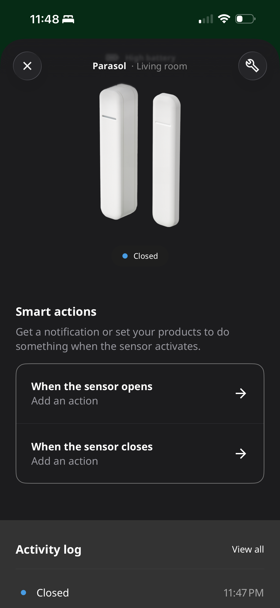
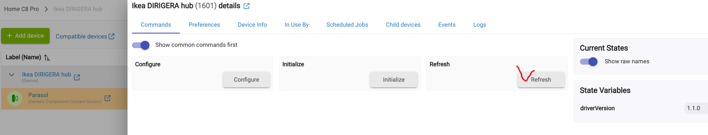

# IKEA PARASOLL Zigbee Sensor (Component Driver)

**Device:** IKEA PARASOLL Door/Window Sensor
**Type:** Component Child Driver (Requires DIRIGERA Bridge)
**Author:** Aniva
**Version:** 2.2.0

## Overview
This driver is designed specifically for the **IKEA PARASOLL** sensor when connected through the **IKEA DIRIGERA Hub**.

It is **not** a standalone Zigbee driver. Instead, it works as a "Child" of the [IKEA DIRIGERA Bridge](../DirigeraBridge/README.md) to provide features that the standard generic drivers lack.

### Key Features
* **Battery Correction:** Automatically converts IKEA's raw 0-200 battery scale into a standard 0-100% reading.
* **Logic Reversal:** Includes a preference to flip "Open" and "Closed" states (useful depending on how you mount the magnet).
* **Automatic Discovery:** No manual pairing to Hubitat required; simply refresh the Bridge.

---

## Prerequisites
* **IKEA DIRIGERA Hub** (Physical Device)
* **[IKEA DIRIGERA Bridge](../DirigeraBridge/README.md)** (Parent Driver) installed on Hubitat.

---

## Installation & Setup

### Step 1: Install the Driver Code
1.  **Via HPM:** Search for "Aniva" and install the **"Ikea Parasoll"** package.
2.  **Manually:** Copy the code from `IkeaParasoll.groovy` in this repo and save it to **Drivers Code** in Hubitat.

### Step 2: Pair Sensor to IKEA Hub
1.  Open the **IKEA Home Smart** app on your phone.
2.  Follow the instructions to pair your **PARASOLL** sensor to the IKEA DIRIGERA Hub.
3.  Ensure it shows up and works in the IKEA app.

 

### Step 3: Sync with Hubitat
1.  Open your Hubitat Web Interface.
2.  Navigate to the **IKEA DIRIGERA Bridge** device you previously set up.
3.  Click the **Refresh** button.
4.  Look at the **"Child Devices"** list (or your main Devices page). The PARASOLL sensor will appear automatically!

 

---

## ⚠️ Migration Note: "Swap Apps Device" Limitation
If you are replacing an old contact sensor with this new Parasoll sensor, please note:

**Hubitat's "Swap Apps Device" tool does NOT support Component Child devices.**
Because the Parasoll sensor is technically a *sub-component* of the Dirigera Bridge, Hubitat hides it from the automatic swap tool to prevent database errors.

**How to Migrate Manually:**
1.  Go to the Device Page of your **Old Sensor**.
2.  Scroll down to the **"In Use By"** section to see exactly which apps/rules are using it.
3.  Open each app (Rule Machine, Dashboards, Alexa, etc.) and manually select the new **Parasoll** device.

---

## Configuration
Once the device is created, you can open its device page to configure settings:

* **Reverse Open/Close Logic:** Toggle this if your sensor reports "Open" when the door is closed (often happens with specific magnet placements).
* **Enable Debug Logging:** Useful for troubleshooting connection issues.