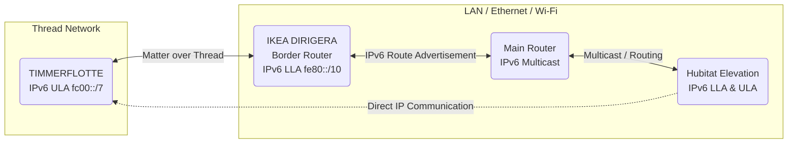
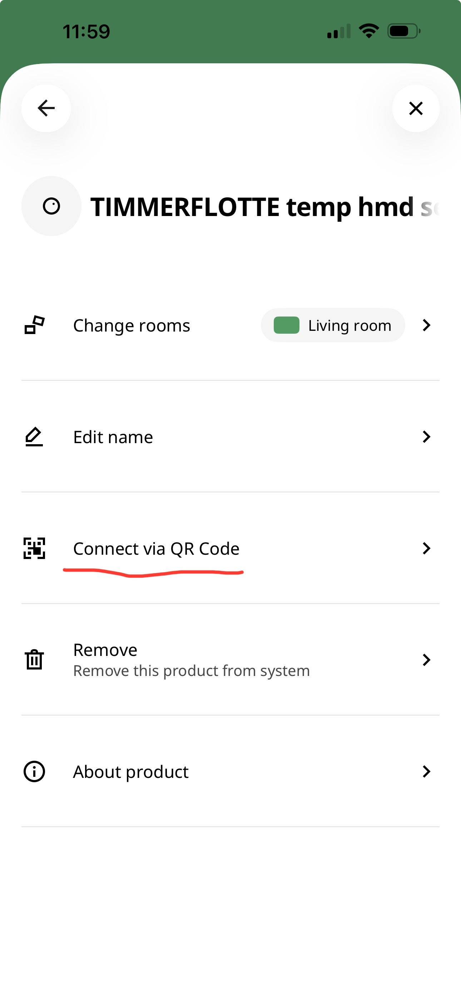
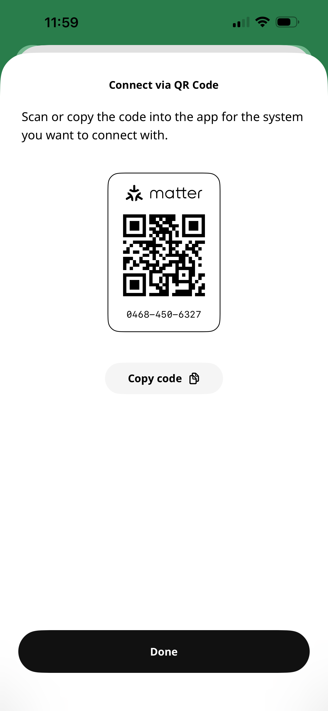
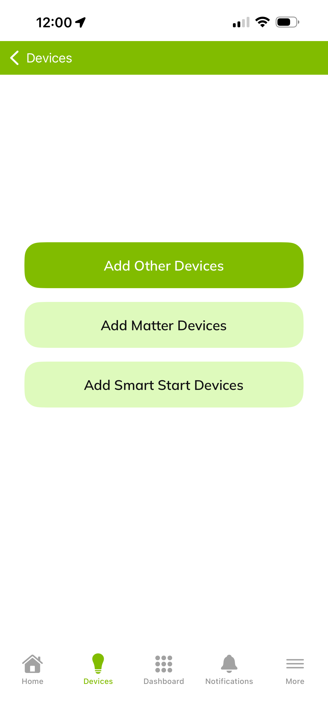

# IKEA TIMMERFLOTTE Matter Sensor for Hubitat

A dedicated, native Hubitat driver for the **IKEA TIMMERFLOTTE** Temperature and Humidity sensor (connected via Matter/Thread).

This driver is designed to work with the **IKEA DIRIGERA** hub acting as the Thread Border Router, bridging the sensor to your Hubitat Elevation hub over the local network.

## Features
* **Auto-Detection:** Automatically fingerprints and selects this driver upon pairing.
* **Full Sensor Support:** Reads Temperature, Relative Humidity, and Battery levels.
* **Robust Connectivity:** Uses Matter Helper libraries for clean subscriptions and endpoint targeting (Temp: `01`, Hum: `02`, Bat: `00`).
* **Aniva Standard Styling:** Custom HTML header with version tracking and links.

## Architecture & Network Requirements

Unlike standard Zigbee devices, this Matter integration relies heavily on your local network's IPv6 routing capabilities.

### IPv6 Matter/Thread Routing
For Hubitat to communicate with the sensor, it must be able to route traffic to the sensor's **Unique Local Address (ULA)** residing on the Thread network. The IKEA DIRIGERA acts as the gateway (Border Router).

**Critical Requirement:** Your network router/firewall must support **IPv6 Router Advertisements (RA)** or allow **Static Routes** pointing to the DIRIGERA's Link-Local Address (LLA).

**Note:** If Hubitat cannot control the device despite pairing successfully, ensure your router is not blocking traffic between your LAN subnet (`fd00::`) and the Thread subnet (`fd78::` / `fc00::`).

## Installation

1.  **Hubitat Package Manager (HPM):** Search for "IKEA TIMMERFLOTTE Matter Sensor" by Aniva.
2.  **Manual Install:**
    * Go to **Drivers Code** in Hubitat.
    * Click **New Driver**.
    * Paste the content of `IkeaTimmerflotte.groovy`.
    * Click **Save**.

## Pairing Instructions

To use this sensor with Hubitat, you **must pair it directly to Hubitat** using the Matter pairing code generated by the IKEA DIRIGERA app. Do not simply add it to DIRIGERA; you must share it.

### Step 1: Generate Matter Code (IKEA App)
1.  Open the IKEA Home smart app.
2.  Navigate to the TIMMERFLOTTE sensor settings.
3.  Select **"Integrations"** or **"Link to other services"** (depending on app version).
4.  Select **Connect via QR Code**.

5.  Copy the code generated by the app.

### Step 2: Add to Hubitat
1.  In the Hubitat Web Interface, go to **Devices**.
2.  Click **Add Device**.
3.  Select **Matter**.

4.  Paste the code you copied from the IKEA app.

### Step 3: Completion
Hubitat will discover the device on your network. Due to the specific fingerprinting in this driver, it should automatically be detected as **"IKEA TIMMERFLOTTE Matter Sensor"**.

If it adds as a generic "Device" or "Unknown Matter Device":
1.  Open the device page.
2.  Change **Type** to **"IKEA TIMMERFLOTTE Matter Sensor"**.
3.  Click **Save Device**.
4.  Click **Configure** (and press the physical button on the sensor once to wake it up).

## Support

If you find this driver useful, consider supporting the development:

* [PayPal Support](https://paypal.me/AndreiIvanov420)
* [GitHub Repository](https://github.com/aniva)

---
**Author:** Aniva
**License:** Apache 2.0