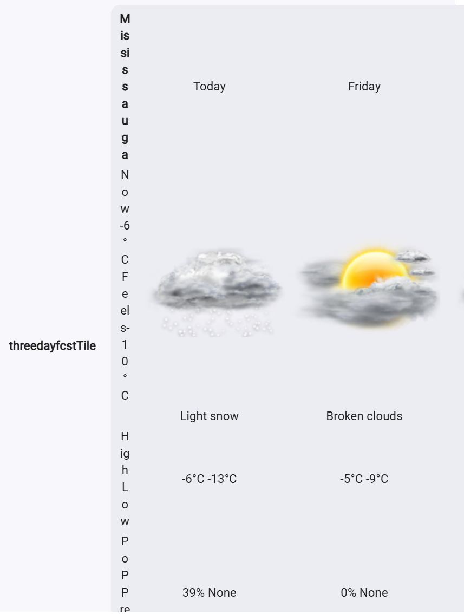
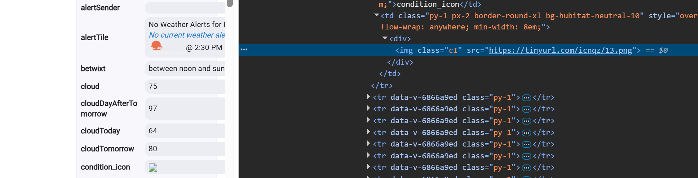
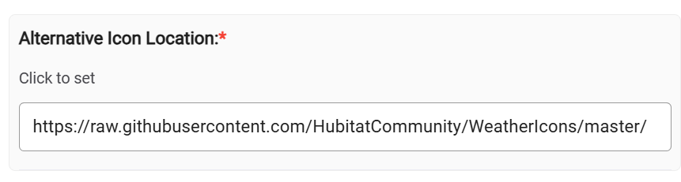

# OpenWeatherMap-Alerts Driver Icon Fix

**Status:** Solved
**Issue:** Weather icons failing to load (broken images) due to dead TinyURL redirect.

## Overview
The standard "OpenWeatherMap-Alerts" driver for Hubitat uses a `tinyurl.com` redirect service to fetch weather icons. This service has stopped working reliably, resulting in broken image links on dashboards.

This guide documents the permanent fix: switching to the direct **HubitatCommunity GitHub** repository.

## The Problem
Dashboard tiles display broken image placeholders instead of weather icons. The browser console reports errors when trying to load images from `tinyurl.com/icnqz`.

## The Solution

There are two steps to this fix. **Step 1 is critical** for any device you have already created.

### 1. Fix Existing Devices (Required)
Hubitat devices "remember" their settings even if the driver code is changed. You must manually update the preference on the device page.

1.  Open your **Weather Device** page in Hubitat.
2.  Scroll down to **Preferences**.
3.  Locate the field: **`Alternative Icon Location:`**
4.  **Delete** the old value (`https://tinyurl.com/icnqz/`).
5.  **Paste** the new working URL:
    '''text
    https://raw.githubusercontent.com/HubitatCommunity/WeatherIcons/master/
    '''
6.  **Click "Save Preferences"** (Crucial Step).
7.  Click **pollData** to refresh the tile.

### 2. Update Driver Code (For Future Devices)
To ensure any *new* weather devices you create work immediately, update the driver's default setting.

1.  Open **Drivers Code** -> **OpenWeatherMap-Alerts Weather Driver**.
2.  Find the `iconLocation` input (around line 65).
3.  Update the `defaultValue` to the new URL:

'''groovy
// OLD
input 'iconLocation', 'text', required: true, defaultValue: 'https://tinyurl.com/icnqz/', title: 'Alternative Icon Location:'

// NEW
input 'iconLocation', 'text', required: true, defaultValue: 'https://raw.githubusercontent.com/HubitatCommunity/WeatherIcons/master/', title: 'Alternative Icon Location:'
'''

## Resources
* **New Icon URL:** `https://raw.githubusercontent.com/HubitatCommunity/WeatherIcons/master/`