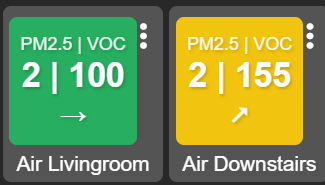
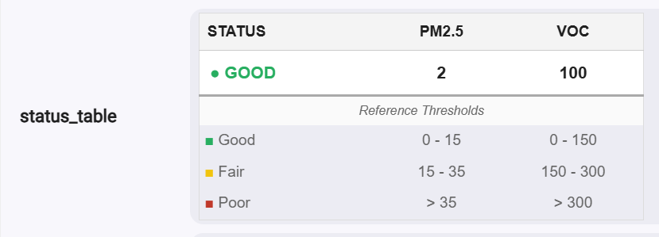
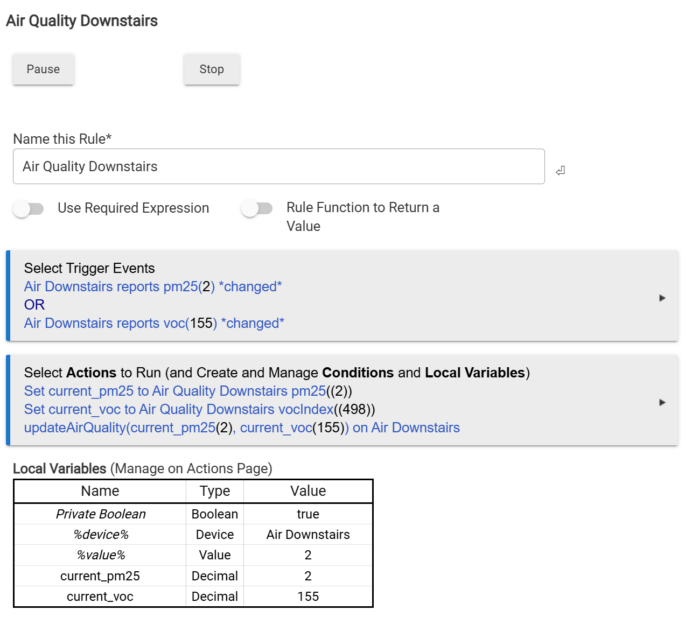

# IKEA VINDSTYRKA Air Quality Tile

**Status:** Stable (v2.3)

## Overview
This project enhances the [IKEA VINDSTYRKA](https://www.ikea.com/us/en/p/vindstyrka-air-quality-sensor-smart-60498233/) Zigbee Air Quality Sensor integration for Hubitat Elevation.

The VINDSTYRKA is a smart air quality monitor that tracks **PM2.5**, **tVOC**, **Temperature**, and **Humidity**. While the sensor pairs natively, this project adds a visual dashboard layer and advanced logic to filter noise.



## Architecture

The system follows a "Bridge" pattern to separate the physical device (Zigbee) from the logic and presentation layer (Virtual Driver).

```mermaid
graph TD
    %% Nodes
    Sensor[IKEA VIRT Sensor<br/>(Physical Device)]
    Hub[Hubitat Elevation<br/>(C-8 Pro)]
    Danache[Danache Driver<br/>(Zigbee Parser)]
    RuleEng[Rule Eng<br/>(Logic Bridge)]
    VirtDriver[VIRT Dev Driver<br/>(Logic & Rendering)]
    VirtDevice[VIRT Device<br/>(Virtual Tile Instance)]
    Dash[Hubitat Dashboard]

    %% Styles
    style Sensor fill:#f9f9f9,stroke:#333,stroke-width:2px
    style Hub fill:#d4efdf,stroke:#27ae60,stroke-width:2px
    style VirtDevice fill:#d6eaf8,stroke:#3498db,stroke-width:2px

    %% Flow
    Sensor -->|Zigbee 3.0| Hub
    Hub -->|Raw Data| Danache
    Danache -->|Events: PM2.5 / VOC| RuleEng
    RuleEng -->|Command: updateAirQuality| VirtDriver
    VirtDriver -->|Updates State| VirtDevice
    VirtDevice -->|Attribute: html_tile| Dash
```

**Flow Description:**
1.  **IKEA VIRT Sensor:** Sends raw environmental data to the hub.
2.  **Hubitat / Danache Driver:** Parses the Zigbee messages into device events.
3.  **Rule Eng:** Detects the changes, bridges the values to the virtual side.
4.  **VIRT Dev Driver (This Code):** Receives data, calculates Linear Regression trends, applies WHO thresholds, and generates HTML.
5.  **VIRT Device:** Stores the current state (`html_tile`, `status_table`) for the Dashboard to read.

## Key Features
1.  **Visual Dashboard Tile:** A minimalist "Nuclear" style CSS tile showing PM2.5 and VOC levels.
2.  **Smart Trends:** Uses **Linear Regression (Slope Analysis)** to show trend direction (↗ ↘) based on a configurable time window, filtering out transient spikes.
3.  **Configurable Thresholds:** Users can customize "Good", "Fair", and "Poor" limits based on WHO guidelines or personal preference.
4.  **Unified Status View:** The driver page includes a "Crash-Proof" live table showing current readings alongside your defined threshold legend.
    
    

## Installation

### Option 1: Hubitat Package Manager (HPM)
* Add the repository URL: `https://raw.githubusercontent.com/aniva/hubitat01/master/repository.json`
* Search for and install **"Vindstyrka Air Quality Tile"**.

### Option 2: Manual Install
1.  Open **Drivers Code** in your Hubitat interface.
2.  Create a New Driver.
3.  Paste the code from `AirQualityTile.groovy`.
4.  Save.

## Setup & Configuration

### 0. Optimize Physical Sensor Reporting (Recommended)
By default, the IKEA sensor may report tiny fluctuations very frequently (e.g., every few seconds), which can trigger the Rule Machine logic unnecessarily often.

1.  Open the **Physical IKEA Sensor** device page.
2.  Locate the setting: **"Throttle events"** (or "Minimum time interval").
3.  Change it from "Report all events" to **2 minutes** (or higher).
4.  Click **Save Preferences**.
    * *Why?* This drastically reduces CPU load on the hub while keeping the dashboard data sufficiently current (air quality rarely changes drastically in under 2 minutes).

### 1. Create the Virtual Device
1.  Go to **Devices** -> **Add Device**.
2.  Choose **Virtual**.
3.  **Device Name:** e.g., "Living Room Air Tile".
4.  **Type:** Select `Vindstyrka Air Quality Tile` (Namespace: `aniva`).
5.  Save Device.

### 2. Configure Preferences
Open the newly created Virtual Device and set your preferences:
* **Trend Window (Minutes):** How far back to analyze data for the trend arrow (Default: 30 mins).
* **Thresholds:** Set your specific limits for "Fair" and "Poor" air quality.
    * *Default PM2.5:* Fair > 15, Poor > 35 (Based on WHO 24h Mean).
    * *Default VOC:* Fair > 150, Poor > 300 (Based on Sensirion Index).

### 3. Connect via Rule Machine (The "Variable Bridge")
Hubitat Rule Machine **cannot** directly pass device attributes (like PM2.5) into custom commands. You must use Local Variables as a bridge.



**Step A: Define Local Variables**
1.  Create a New Rule (e.g., "Sync Air Quality Tile").
2.  Click **Local Variables**.
3.  Create `current_pm25` (Type: **Decimal**, Value: 0).
4.  Create `current_voc` (Type: **Decimal**, Value: 0).

**Step B: Select Triggers**
1.  Select **Trigger Events**.
2.  Capability: `Custom Attribute` -> Device: **Physical IKEA Sensor** -> Attribute: `Pm25` -> *changed*.
3.  Capability: `Custom Attribute` -> Device: **Physical IKEA Sensor** -> Attribute: `VocIndex` -> *changed*.

**Step C: Configure Actions (The Bridge Logic)**
You must set the variables *before* running the command.

1.  **Action 1: Capture PM2.5**
    * Select Action: **Set Variable**.
    * Select Variable to Set: **`current_pm25`**.
    * Operation: **Device Attribute**.
    * Select Device: **Physical IKEA Sensor** (Source).
    * Select Attribute: **`Pm25`**.

2.  **Action 2: Capture VOC**
    * Repeat the steps above for **`current_voc`** mapping to attribute **`VocIndex`**.

3.  **Action 3: Update the Tile**
    * Select Action: **Run Custom Action**.
    * Select Capability: **Actuator**.
    * Select Device: **Virtual Tile Device** (Destination).
    * Select Command: **`updateAirQuality`**.
    * **Parameter 1:** Type: **Decimal** -> Click **"Use Variable"** -> Select **`current_pm25`**.
    * **Parameter 2:** Type: **Decimal** -> Click **"Use Variable"** -> Select **`current_voc`**.

4.  Click **Done** to save the rule.

## Dashboard Configuration
1.  Add a tile to your Hubitat Dashboard.
2.  Select the **Virtual Device** created above.
3.  Select the **Attribute** template.
4.  Choose the `html_tile` attribute.

## Credits
* **Author:** Aniva
* **Platform:** Hubitat Elevation