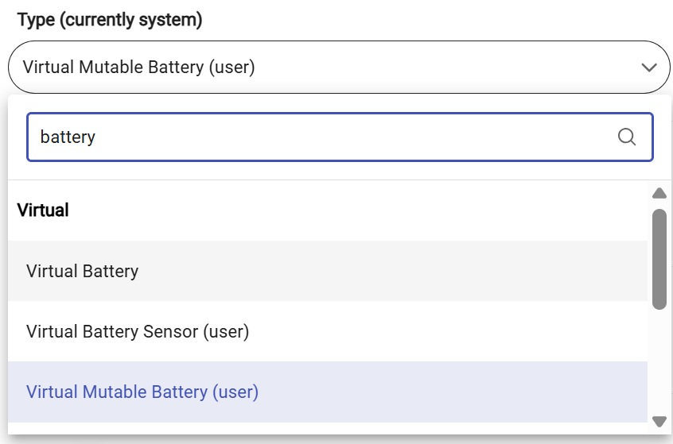
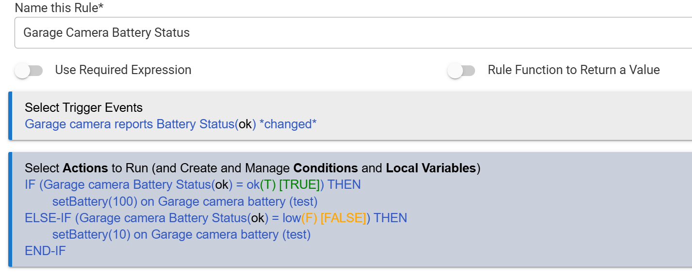

# Virtual Mutable Battery

A specialized virtual driver for Hubitat Elevation designed to bridge the gap between "Status-based" battery reports and "Percentage-based" dashboards.

## The Problem
Many cloud integrations (like Blink cameras or older Zigbee devices) only report battery as a text string: `"OK"`, `"Low"`, or `"Critical"`.
* Hubitat's standard Battery Tile requires a **number** (0-100%).
* Standard Virtual Battery drivers are "Read Only" and cannot be controlled by Rule Machine.

## The Solution
**Virtual Mutable Battery** acts as a proxy.
1.  It exposes the `Actuator` capability so it appears in Rule Machine actions.
2.  It accepts a custom `setBattery(level)` command.
3.  You create a simple rule:
    * IF Camera reports "Low" -> Set Virtual Battery to `15%`.
    * IF Camera reports "OK" -> Set Virtual Battery to `100%`.

## Installation

### Method 1: Hubitat Package Manager (Recommended)
1.  Open **HPM**.
2.  Search for **"Virtual Mutable Battery"** (by Aniva).
3.  Install.

### Method 2: Manual Install
1.  Copy the code from `VirtualBattery.groovy`.
2.  In Hubitat, go to **Drivers Code** -> **New Driver**.
3.  Paste and Save.
4.  Create a new Virtual Device using this driver type.

## Configuration
After installing, ensure your virtual device is using the **Virtual Mutable Battery** driver type. This ensures the "Actuator" capability is present so Rule Machine can see it.

## How to Use (Rule Machine)

To update this battery from a rule, you must select the **Actuator** capability in your action.

1.  **Trigger:** Camera Battery Status *changed*.
2.  **Action:** Run Custom Action -> `setBattery(level)`.

**Example Logic:**
In the example below, we check if the camera reports "Low" (False). If so, we force the Virtual Battery to `15%` (Red tile). Otherwise, we set it to `100%` (Green tile).

### Step-by-Step Rule Action:
1.  Select **"Set Variable, Mode or File, Run Custom Action"**.
2.  Select **"Run Custom Action"**.
3.  **Important:** For "Select capability of action device", choose **Actuator**.
    * *Note: If you search under "Battery", you will not find the command.*
4.  Select your **Virtual Mutable Battery** device.
5.  Select Custom Command: `setBattery`.
6.  Parameter Type: **Number**.
7.  Value: `100` (for Good) or `15` (for Low).

**Visual Guide for Step 3:**

## Support

If you find this driver useful, consider supporting the development:

* [PayPal Support](https://paypal.me/AndreiIvanov420)
* [GitHub Repository](https://github.com/aniva)

---
**Author:** Aniva
**License:** Apache 2.0