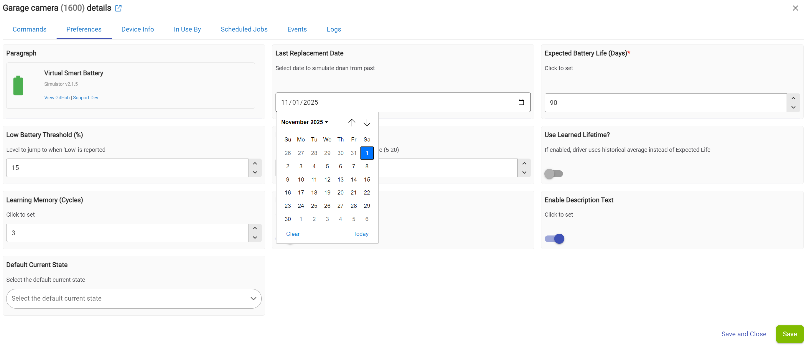

# Virtual Smart Battery (Mutable)

**Project:** Virtual Smart Battery Driver
**Platform:** Hubitat Elevation
**Author:** Aniva
**Version:** 2.1.5

## Overview
The **Virtual Smart Battery** is a specialized driver designed to bridge the gap between devices that only report vague battery status (e.g., "OK", "Low") and standard percentage-based dashboards.

Unlike standard virtual drivers, this is a **Smart Simulator**. It doesn't just sit at 100%; it gradually simulates battery drain over time based on your expected battery life, giving you a realistic "fuel gauge" for devices that lack one (like Blink cameras or older Zigbee sensors).

## Key Features

### 1. 🧠 Smart Simulation
Instead of showing "100%" for months and then suddenly dropping to "10%", this driver calculates a daily drain rate based on your **Expected Battery Life** setting. It updates the percentage automatically, providing a smooth curve on your dashboard.

### 2. ⏳ Time Machine (Date Selector)
Replacing a battery but forgot to reset the driver? No problem.
Use the **"Last Replacement Date"** selector to pick a date in the past. The driver will instantly recalculate what the battery percentage *should* be today based on that start date.

### 3. 🎓 Adaptive Learning
The driver gets smarter over time. If you enable **"Use Learned Lifetime"**, it tracks the actual time between "OK" and "Low" status reports. After a few cycles, it replaces your manual estimate with the *actual* average lifespan of your specific device.

---

## Part 1: Installation

### Method 1: Hubitat Package Manager (Recommended)
1.  Open **HPM**.
2.  Search for **"Virtual Smart Battery"** (by Aniva).
3.  Install.

### Method 2: Manual Install
1.  Copy the code from `VirtualBattery.groovy`.
2.  In Hubitat, go to **Drivers Code** -> **New Driver**.
3.  Paste and Save.

---

## Part 2: Create the Virtual Device
Once the driver code is installed, you need to create the device instance.

1.  Go to **Devices** -> **Add Device**.
2.  Select **Virtual**.
3.  Enter a **Device Name** (e.g., "Garage Camera Battery").
4.  In the **Type** field, start typing **"Virtual Smart Battery"** and select it from the list (under User).
5.  Click **Save Device**.

---

## Part 3: Configuration
Go to the newly created **Device Page** to configure the simulation logic.

* **Last Replacement Date:** Set this to the day you put in the fresh battery. The driver uses this to calculate the current percentage.
* **Expected Battery Life:** How many days does this battery usually last? (e.g., 90 days).
* **Low Battery Threshold:** What percentage should the battery jump to when the real device finally reports "Low"? (Default: 15%).
* **Decrement Intervals:** Controls how "smooth" the drain curve is (higher = more frequent, smaller drops).

---

## Part 4: Rule Machine Setup (The Bridge)

To make this work, you need a simple rule that tells the Virtual Driver what the *Real* Device is saying.

**Important:** We use the new smart command `setSourceStatus` instead of setting raw numbers. This allows the driver to handle the logic (resetting dates, ending cycles, etc.).

### The Rule Logic
* **Trigger:** Camera Battery Status *changed*.
* **Action 1:** IF Camera is "OK" -> Run Custom Command: `setSourceStatus('OK')`.
* **Action 2:** ELSE-IF Camera is "Low" -> Run Custom Command: `setSourceStatus('Low')`.

### How to Create the Action
1.  Select **"Set Variable, Mode or File, Run Custom Action"**.
2.  Select **"Run Custom Action"**.
3.  **Critical Step:** For "Select capability of action device", choose **Actuator**.
    * *Note: The command is hidden if you filter by "Battery".*
4.  Select your **Virtual Smart Battery** device.
5.  Select Custom Command: `setSourceStatus`.
6.  Parameter Type: **String**.
7.  Value: `OK` (or `Low`).

---

## Support
If you find this driver useful, you can support the development here:
[PayPal.me/AndreiIvanov420](https://paypal.me/AndreiIvanov420)