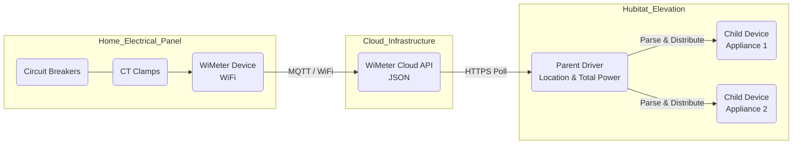

# WiMeter Cloud Bridge for Hubitat

**Version:** v4.19
**Author:** Andrei Ivanov (aniva)
**License:** Open Source

## Overview
This driver connects your WiMeter energy monitor to Hubitat Elevation. It polls the WiMeter Cloud API to retrieve real-time power (W/kW), energy (kWh), and cost ($) data for your main location and all individual appliances.

It uses a **Parent-Child** architecture:
* **Parent Device:** Represents the main location (e.g., "Andrei's House").
* **Child Devices:** Automatically created for every appliance found in your WiMeter account (e.g., "Boiler", "A/C").

### About WiMeter
**WiMeter** is a smart, retrofit energy monitoring system designed for residential and commercial electrical panels. It installs directly into your breaker box to provide granular monitoring of up to **28 individual circuits**.

Unlike simple smart plugs or utility meters, WiMeter offers:
* **Real-time monitoring** of voltage, current, and power factor.
* **Critical Systems Health Check:** Uses power profiling and temperature sensors to detect equipment malfunctions before failure.
* **Immediate Insights:** No "learning period" required; data is available immediately after installation.
* **Universal Compatibility:** Works with 1, 2, or 3-phase systems (100-600V).

For more information, visit the official site: [https://www.wimeter.ai/](https://www.wimeter.ai/)

### Architecture
The integration bridges your physical home wiring data to your Hubitat hub via the WiMeter Cloud API.

---

## Features

### 1. Zero-Configuration Setup
Simply enter your WiMeter username and password. The driver will:
* Authenticate with the Cloud API.
* Detect your Location (Main Panel).
* **Automatically Create Child Devices** for every circuit/appliance defined in your account.
* Auto-correct names if they change on the WiMeter side.

### 2. Live Dashboard Tile (HTML)
The driver generates a pre-formatted HTML tile (`htmlTile` attribute) that you can display on any Hubitat Dashboard. This tile changes color dynamically based on power usage or connection status.

**Status Logic & Colors:**
* **High Load:** **Red** (Default: > 6kW)
* **Medium Load:** **Yellow** (Default: > 3kW)
* **Active:** **Green** (Default: > 1kW)
* **Idle:** **Grey** (Default: < 1kW)
* **Offline:** **Black** (API Error or No Data)

*Note: Thresholds are fully customizable in the Device Preferences.*

### 3. Rule Machine Ready
This driver exposes a dedicated attribute called **`powerLevel`** specifically for automation logic. Instead of writing complex numeric rules ("If power > 3500 AND power < 5000..."), you can simply write:
* `IF powerLevel is "High" THEN Turn on Warning Light`
* `IF powerLevel is "Offline" THEN Send Notification`

### 4. Cost Tracking
In addition to Watts/Kilowatts, the driver retrieves the calculated **Cost** from the WiMeter platform (Real-time, Daily, Weekly, Monthly), allowing you to build dashboards focused on budget rather than just electrical units.

---

## Installation

### Via Hubitat Package Manager (Recommended)
1.  Search for **"WiMeter Cloud Bridge"** by Aniva.
2.  Install the package (this includes both Parent and Child drivers).

### Manual Installation
1.  Install `WiMeterCloudBridge.groovy` (Parent Driver).
2.  Install `WiMeterCloudBridgeChild.groovy` (Child Driver).
3.  Create a new Virtual Device using the **WiMeter Cloud Bridge** driver.

---

## Setup & Configuration

1.  Open the **WiMeter Cloud Bridge** device.
2.  Enter your **Username** and **Password** in the Preferences.
3.  Set your desired **Poll Interval** (Default: 5 minutes).
4.  (Optional) Adjust the **kW Thresholds** for the colored dashboard tiles.
5.  Click **Save Preferences**.
6.  The driver will immediately poll the API, populate the data, and create child devices for your circuits.

### Fixing the "Question Mark" Icon
By default, Hubitat assigns a generic **`?`** icon to devices that are purely Power Meters (not switches).
**Solution:** You can manually assign the correct "Lightning Bolt" icon using the platform's built-in icon selector.

1.  Open the **Device Detail** page for your WiMeter device.
2.  Click the **`?`** icon next to the device name at the top.
3.  In the popup, filter for **"flash"** or **"bolt"**.
4.  Select the desired icon and click **Save**.

---

## 5. Optional: Bridging to a "Virtual Omni Sensor"
If you prefer to use standard Hubitat "Power Meter" tiles or integrate with other apps (like HomeKit bridges), you can sync the data to a standard **Virtual Omni Sensor**.

### Step 1: Create the Virtual Device
1.  Go to **Devices** -> **Add Virtual Device**.
2.  **Device Name:** "House Power Bridge".
3.  **Type:** **`Virtual Omni Sensor`**.
4.  Click **Save Device**.

### Step 2: Create the Sync Rule (Rule Machine)
1.  Open **Rule Machine** -> **Create New Rule**.
2.  **Trigger:** Capability `Custom Attribute` -> Device `WiMeter Cloud Bridge` -> Attribute `locationPowerRealTimeW` -> `*changed*`.
3.  **Action:** Run Custom Action -> Capability `Sensor` -> Device "House Power Bridge" -> Command **`setPower`**.
4.  **Parameter:** Type `Decimal` -> Value `%value%`.
5.  Click **Done**.

---

## ❤️ Support
If you find this driver useful, consider supporting the development:

* [PayPal Support](https://paypal.me/AndreiIvanov420)
* [GitHub Repository](https://github.com/aniva)