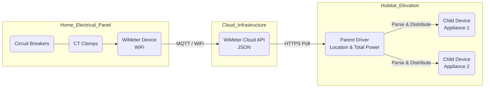
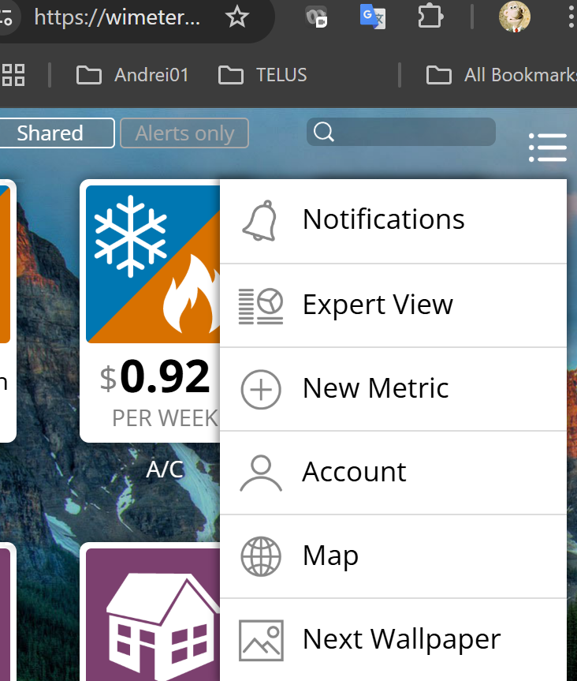
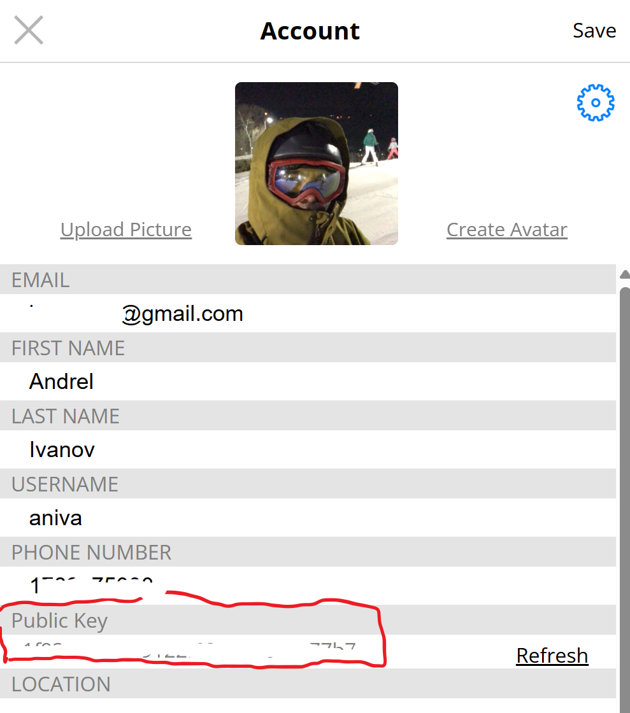
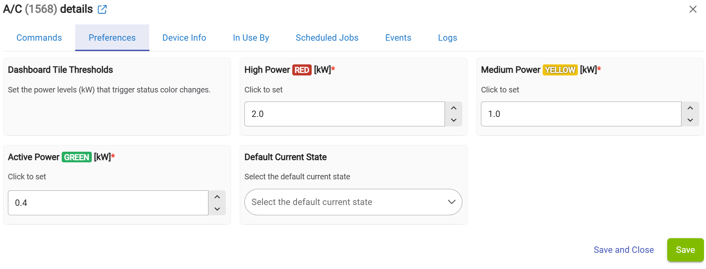
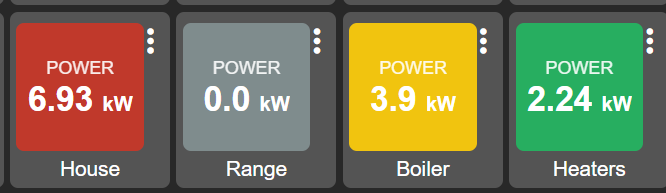
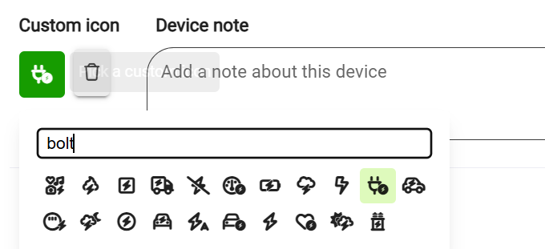

# WiMeter Cloud Bridge for Hubitat

**Version:** v4.19
**Author:** Andrei Ivanov (aniva)
**License:** Open Source

## Overview
This driver connects your WiMeter energy monitor to Hubitat Elevation. It polls the WiMeter Cloud API to retrieve real-time power (W/kW), energy (kWh), and cost ($) data for your main location and all individual appliances.

It uses a **Parent-Child** architecture:
* **Parent Device:** Represents the main location (e.g., "Andrei's House").
* **Child Devices:** Automatically created for every appliance found in your WiMeter account (e.g., "Boiler", "A/C").

### About WiMeter
**WiMeter** is a smart, retrofit energy monitoring system designed for residential and commercial electrical panels. It installs directly into your breaker box to provide granular monitoring of up to **28 individual circuits**.

For more information, visit the official site: [https://www.wimeter.ai/](https://www.wimeter.ai/)

### Architecture
The integration bridges your physical home wiring data to your Hubitat hub via the WiMeter Cloud API.

---

## 1. Installation

### Via Hubitat Package Manager (Recommended)
1.  Search for **"WiMeter Cloud Bridge"** by Aniva.
2.  Install the package (this includes both Parent and Child drivers).

### Manual Installation
1.  Install `WiMeterCloudBridge.groovy` (Parent Driver).
2.  Install `WiMeterCloudBridgeChild.groovy` (Child Driver).
3.  Create a new Virtual Device using the **WiMeter Cloud Bridge** driver.

---

## 2. Setup & Configuration

### Step 1: Obtain your API Key
To connect Hubitat to your WiMeter, you need your unique **Public Key**.

1.  Log in to your account at [wimeter.net](https://wimeter.net).
2.  Click the **User Menu** (top right corner) and select **Account**.

3.  Scroll down to find your **Public Key**. Copy this string (e.g., `e1f93aec...`).

### Step 2: Configure the Driver
1.  Open the **WiMeter Cloud Bridge** device in Hubitat.
2.  Paste your key into the **Public Key** field.
3.  Enter your **Target Location Name** exactly as it appears in WiMeter (e.g., "My House").
4.  Set your desired **Polling Interval** (Default: 5 Minutes).

5.  Click **Save Preferences**. The driver will immediately attempt to connect.

---

## 3. Dashboard Integration

The driver generates a pre-formatted HTML tile (`htmlTile` attribute) that you can display on any Hubitat Dashboard. This tile creates a clean, "Mobile App" look without requiring complex CSS on the dashboard side.

### Visual Status Logic
The tile changes color dynamically based on power usage or connection status. You can customize the KW thresholds for these colors in the **Preferences** section.

* **High Load:** **Red** (Default: > 6kW)
* **Medium Load:** **Yellow** (Default: > 3kW)
* **Active:** **Green** (Default: > 1kW)
* **Idle:** **Grey** (Default: < 1kW)
* **Offline:** **Black** (API Error or No Data)

### Example Dashboard

### Fixing the "Question Mark" Icon
By default, Hubitat assigns a generic **`?`** icon. You can manually assign the correct "Lightning Bolt" icon using the platform's built-in selector.

1.  Click the **`?`** icon next to the device name.
2.  Filter for **"flash"** or **"bolt"**.
3.  Select the desired icon.

---

## 4. Automation (Rule Machine)

This driver is designed to make automation easy. Instead of writing complex numeric comparisons ("If power is greater than 3500 but less than 5000..."), use the **`powerLevel`** attribute.

### Attribute: `powerLevel`
Values: `Idle`, `Active`, `Medium`, `High`, `Offline`.

### Example Rule: Offline Notification
If your WiMeter stops reporting data (power outage or internet loss), the driver sets the state to `Offline`.

1.  **Trigger:** `Custom Attribute` -> Device: `WiMeter Bridge` -> Attribute: `powerLevel` -> **Changed**.
2.  **Actions:**
    * **IF** (powerLevel is "Offline") THEN
        * Notify Phone: "⚠️ WiMeter is Offline! Check main power."
    * **ELSE-IF** (powerLevel is "High") THEN
        * Turn on: "Living Room Warning Light" (Red)
    * **END-IF**

### Advanced: Bridging to Virtual Omni Sensor
If you need to sync data to other systems (like HomeKit) that require standard "Power Meter" capabilities, you can bridge the data to a virtual sensor.

1.  Create a Virtual Device using the **`Virtual Omni Sensor`** driver.
2.  Create a Rule that triggers on `locationPowerRealTimeW` changes.
3.  Action: `Run Custom Action` -> `setPower` -> value `%value%` on the virtual sensor.

---

## ❤️ Support
If you find this driver useful, consider supporting the development:

* [PayPal Support](https://paypal.me/AndreiIvanov420)
* [GitHub Repository](https://github.com/aniva)