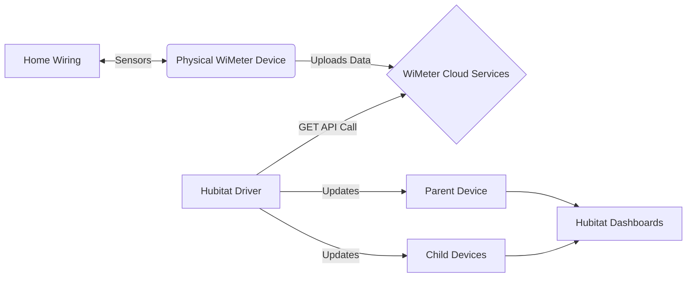

# WiMeter Cloud Bridge for Hubitat

**Version:** v4.15
**Author:** Andrei Ivanov (aniva)
**License:** Open Source

## Overview
This driver connects your WiMeter energy monitor to Hubitat Elevation. It polls the WiMeter Cloud API to retrieve real-time power (W/kW), energy (kWh), and cost ($) data for your main location and all individual appliances.

It uses a **Parent-Child** architecture:
* **Parent Device:** Represents the main location (e.g., "Andrei's House").
* **Child Devices:** Automatically created for every appliance found in your WiMeter account (e.g., "Boiler", "A/C").

### About WiMeter
**WiMeter** is a smart, retrofit energy monitoring system designed for residential and commercial electrical panels. It installs directly into your breaker box to provide granular monitoring of up to **28 individual circuits**.

Unlike simple smart plugs or utility meters, WiMeter offers:
* **Real-time monitoring** of voltage, current, and power factor.
* **Critical Systems Health Check:** Uses power profiling and temperature sensors to detect equipment malfunctions before failure.
* **Immediate Insights:** No "learning period" required; data is available immediately after installation.
* **Universal Compatibility:** Works with 1, 2, or 3-phase systems (100-600V).

For more information, visit the official site: [https://www.wimeter.ai/](https://www.wimeter.ai/)

### Architecture
The integration bridges your physical home wiring data to your Hubitat hub via the WiMeter Cloud API.

---

## 1. Installation (Hubitat Package Manager)
The driver is available in the official **Hubitat Package Manager (HPM)** repository.

1.  Open **Hubitat Package Manager** app.
2.  Select **Install**.
3.  Select **Search by Keywords** and type `WiMeter`.
4.  Select **WiMeter Cloud Bridge** from the results and click **Install**.
5.  *That's it! HPM will now keep your driver up to date automatically.*

---

## 2. Configuration
After installing the driver, open the **WiMeter Cloud Bridge** device page and scroll to the **Preferences** section.

### Required Settings
1.  **WiMeter API URL:** Paste your personal API key URL here (e.g., `https://wimeter.net/v1/pubmatrix?key=...`).
2.  **Target Location Name:** Enter the exact name of the location as it appears in your WiMeter dashboard (e.g., `Andrei's House`).
3.  **Polling Interval:** Select how often Hubitat should check for new data.
    * *Recommended:* **5 Minutes**.
4.  **Enable Debug Logging:** Turn this **On** if troubleshooting connection issues.

*(Click **Save Preferences** after making changes)*

---

## 3. Dashboard Setup: The "Live Status" Card
This driver generates a pre-formatted, color-coded HTML tile (Green/Yellow/Red) that displays real-time power usage.

### Color Thresholds & Configuration
You can customize the specific **kW thresholds** that trigger each color in the device **Preferences**. This allows you to differentiate between "Idle" states and "High Load" states.

* **Idle (Grey):** Device is off or standby (Below "Active" threshold).
* **Low/Active (Green):** Normal operation (Below "Medium" threshold).
* **Medium (Yellow):** Moderate loads (Below "High" threshold).
* **High (Red):** Heavy loads (Above "High" threshold).

### How to Add the Tile
1.  Open your Hubitat **Dashboard**.
2.  Click **Add Tile (+)**.
3.  **Pick a Device:** Select your `WiMeter Cloud Bridge` (or any Child Device).
4.  **Pick a Template:** Select **Attribute**.
5.  **Pick an Attribute:** Select **`html_tile`**.
6.  **Click Add Tile.**

---

## 4. Custom Icons (Important)
**Issue:** By default, Hubitat assigns a generic **`?`** icon to devices that are purely Power Meters (not switches).
**Solution:** You can manually assign the correct "Lightning Bolt" icon using the platform's built-in icon selector.

1.  Open the **Device Detail** page for your WiMeter device.
2.  Click the **`?`** icon next to the device name at the top.
3.  In the popup, filter for **"flash"** or **"bolt"**.
4.  Select the desired icon and click **Save**.

---

## 5. Optional: Bridging to a "Virtual Omni Sensor"
If you prefer to use standard Hubitat "Power Meter" tiles or integrate with other apps (like HomeKit bridges), you can sync the data to a standard **Virtual Omni Sensor**.

### Step 1: Create the Virtual Device
1.  Go to **Devices** -> **Add Virtual Device**.
2.  **Device Name:** "House Power Bridge".
3.  **Type:** **`Virtual Omni Sensor`**.
4.  Click **Save Device**.

### Step 2: Create the Sync Rule (Rule Machine)
1.  Open **Rule Machine** -> **Create New Rule**.
2.  **Trigger:** Capability `Custom Attribute` -> Device `WiMeter Cloud Bridge` -> Attribute `locationPowerRealTimeW` -> `*changed*`.
3.  **Action:** Run Custom Action -> Capability `Sensor` -> Device "House Power Bridge" -> Command **`setPower`**.
4.  **Parameter:** Type `Decimal` -> Value `%value%`.
5.  Click **Done**.

---

## ❤️ Support
If you find this driver useful, you can support the development here:
[PayPal.me/AndreiIvanov420](https://paypal.me/AndreiIvanov420)